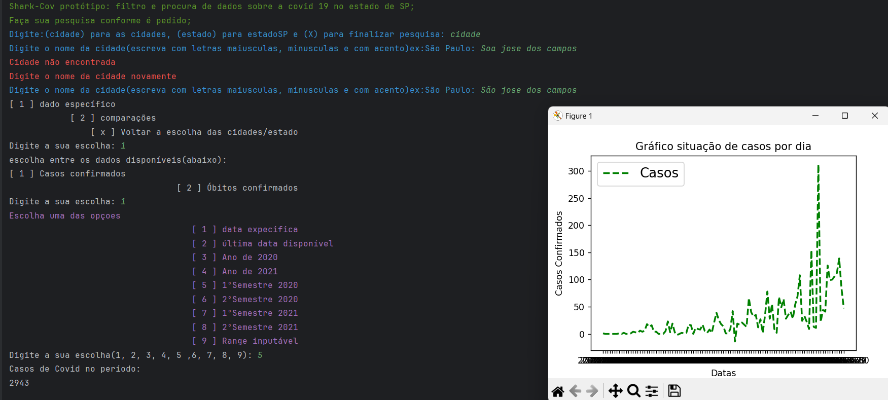

# Projeto 1: 2º Semestre de 2021 

### Repositório do Projeto

[SharkTech-Fatec](https://github.com/heyMichaelS/Projeto-Integrador-2021-2-Grupo3)

      

### Parceiro Acadêmico
Interno - FATEC

### Visão do Projeto

Foi criado um software para computador utilizando Python com o objetivo de analisar e apresentar informações sobre a COVID-19 no estado de São Paulo. O programa foi projetado para coletar, processar e exibir dados da pandemia de forma detalhada, utilizando diferentes formas de visualização. O foco principal foi na manipulação de dados em formato CSV sem depender fortemente de APIs externas ou relatórios de fontes governamentais online, garantindo uma funcionalidade offline robusta.

      

## Tecnologias Utilizadas</h2>

Back-End

* Python
* Jupyter Notebook
* Pandas
* matplotlib.pyplot
* Unidecode

Reuniões e Comunicação

* Discord
* WhatsApp

Outras Ferramentas

* Github
* PyCharm
* Figma

### Contribuições Pessoais

Durante minha participação no projeto interno realizado em colaboração com a faculdade, concentrei-me na implementação da parte de dados do sistema, utilizando a linguagem de programação Python. Minha contribuição foi fundamental para a criação de um programa eficaz e simples, capaz de fornecer estatísticas e visões gráficas dos dados relacionados à COVID-19 no estado de São Paulo. Aqui estão algumas das contribuições específicas que ofereci

## Desenvolvimento do Programa em Python
  
- Assumi a responsabilidade pelo desenvolvimento do programa em Python, utilizando bibliotecas como Pandas, Matplotlib e Unidecode para coletar, tratar e visualizar dados de forma eficiente.

## Coleta e Tratamento de Dados 

- Fui encarregado da coleta e tratamento dos dados da COVID-19, assegurando a precisão e relevância das informações utilizadas no programa.

## Integração de Bibliotecas e Ferramentas

  - Selecionando e integrando bibliotecas específicas, contribuí para a funcionalidade do programa, proporcionando análises visuais detalhadas.

## Resolução de Problemas Técnicos 

  -  Identifiquei e resolvi eficientemente desafios técnicos relacionados à manipulação e visualização de dados, assegurando a robustez do programa.

## Apresentação de Resultados 

 - Participei ativamente na apresentação dos resultados do projeto, compartilhando insights obtidos durante a análise de dados e explicando as escolhas técnicas realizadas.

 - Essas contribuições refletem meu compromisso e habilidades no desenvolvimento deste projeto, destacando minha capacidade técnica e colaborativa na análise de dados da COVID-19 para a faculdade.

### Soft skills

 `Comunicação eficaz:` A participação no projeto envolveu a comunicação com a equipe, expressando ideias de maneira clara no desenvolvimento do programa e na apresentação do projeto.

    

`Trabalho em equipe:` Colaborar em um projeto como esse exigiu habilidades de trabalho em equipe, compartilhando responsabilidades, feedback e mantendo uma comunicação eficiente.
  
    

`Resolução de problemas:` Ao enfrentar bugs no programa e desafios relacionados à coleta e tratamento de dados, você desenvolveu habilidades de resolução de problemas, identificando e corrigindo questões de forma eficaz.

     
    

`Gestão do tempo:` O cronograma apresentado indica uma abordagem de gerenciamento de tempo, estabelecendo metas específicas para cada sprint. Isso demonstra a capacidade de planejar e organizar o tempo de forma eficiente.
    
    
   
### Aprendizados Efetivos Hard Skills
<table>
  <tr>
    <th width="300px">Tecnologia/Metodologia</th>
    <th width="300px">Classificação</th>
  </tr>
  <tr>
    <td>Python</td>
    <td>★★★★★☆☆☆☆☆</td>
  </tr>
  <tr>
    <td>Pandas</td>
    <td>★★★☆☆☆☆☆☆☆</td>
  </tr>
  <tr>
    <td>Jupyter Notebook</td>
    <td>★★★☆☆☆☆☆☆☆</td>
  </tr>
  <tr>
    <td>matplotlib.pyplot</td>
    <td>★★★☆☆☆☆☆☆☆</td>
  </tr>
   <tr>
    <td>Unidecode</td>
    <td>★★★☆☆☆☆☆☆☆</td>
   </tr>
    <tr>
    <td>Github</td>
    <td>★★★☆☆☆☆☆☆☆</td>
   </tr>
   
    
</table>

