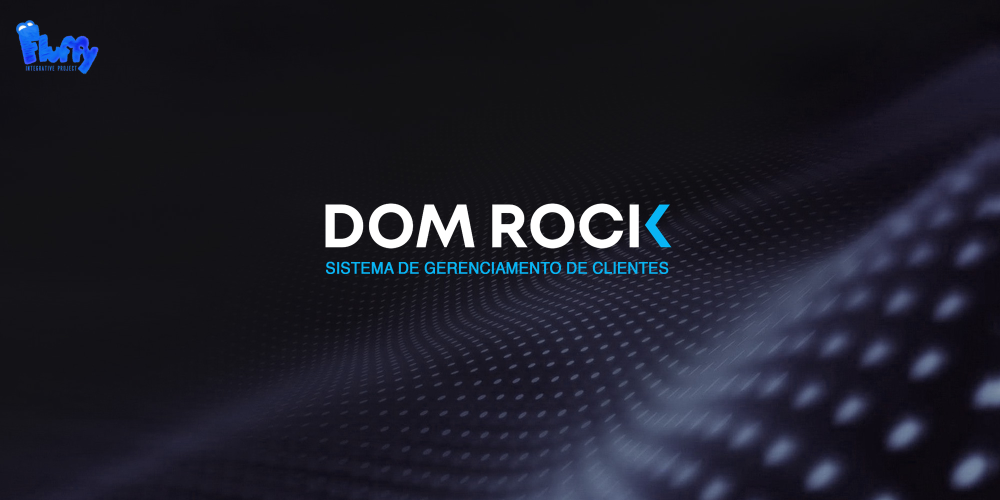
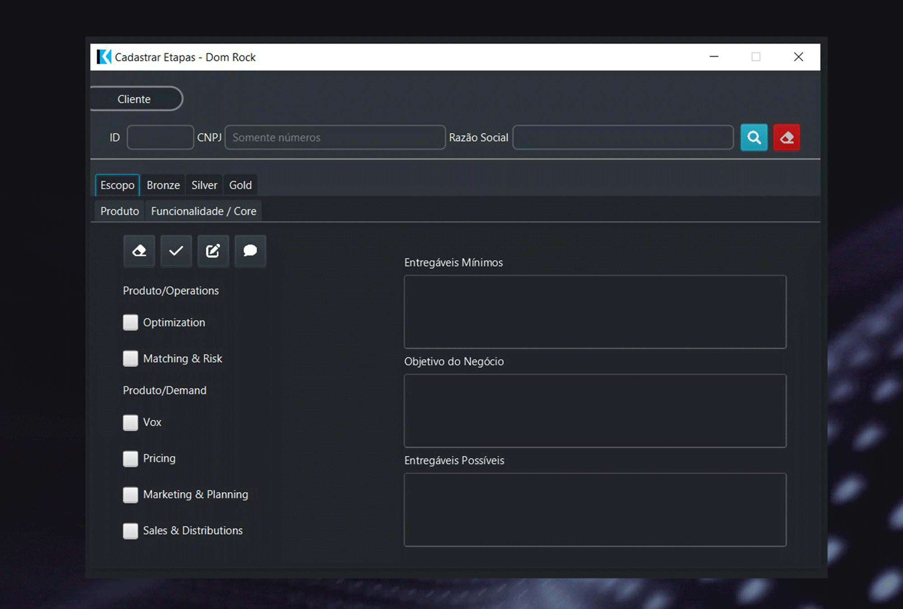

# Projeto 2: 1º Semestre de 2022 

Parceiro Acadêmico

      

Fornece tecnologia para alta produtividade e agilidade nas decisões operacionais e estratégicas das organizações através da poderosa combinação de algoritmos de inteligência artificial, modelos complexos e arquitetura de datalake. A tecnologia foi projetada em ambiente de computação em nuvem totalmente automatizado e auto escalável para lidar com dados estruturados e não estruturados.

 
### Visão do Projeto

Desenvolver uma solução eficiente para a gestão de ativação de clientes na plataforma Dom Rock, proporcionando uma entrada de dados flexível e alocando recursos de forma inteligente. O sistema visa facilitar a entrada de parâmetros e variáveis específicas de cada cliente, estimando o consumo de recursos com base em diferentes métricas. Além disso, a plataforma busca uma base de dados robusta e bem modelada para suportar futuras integrações com outros sistemas.

  

      
  

        
### Tecnologias Adotadas na Solução

 
 Front-End 

      
* [JavaFX Scene Builder 3](https://www.oracle.com/java/technologies/javafxscenebuilder-1x-archive-downloads.html)

Back-End

      
* [Java](https://www.java.com/pt-BR/?msclkid=7faa842eb8f811ecab39772d4c1ae90b)

Banco de Dados

* [SQL Server Nuvem Azure](https://azure.microsoft.com/pt-br/services/sql-database/campaign/)

Reuniões e Comunicação

* [Discord](https://discord.com/?msclkid=b4f5af84b8f811ecbd81c127a0ae68a7)

* [Whatsapp](https://www.whatsapp.com/)

* [Slack](https://slack.com/intl/pt-br/?msclkid=c00e628eb8f811ecaef374bb86d7f056)

Outras Ferramentas

* [Github](https://github.com/)

* [Eclipse IDE](https://www.eclipse.org/downloads/)

* [IntelliJ IDE](https://www.jetbrains.com/idea/promo/?msclkid=6ae44e88c2811d86c0ae2cdbd94ffcfb&utm_source=bing&utm_medium=cpc&utm_campaign=AMER_en_BR_IDEA_Branded&utm_term=intellij&utm_content=intellij%20idea)

* [Jira](https://www.atlassian.com/br/software/jira?msclkid=c8e971f7b8f811ec957d13ca3bfc6c1b)

* [Figma](https://www.figma.com/)

* [Photoshop](https://www.adobe.com/br/products/photoshop.html?sdid=KQPOM&mv=search&ef_id=d67181c6b224183a4875e395ae54f4bf:G:s&s_kwcid=AL!3085!10!79302406606568!79302288716688&msclkid=d67181c6b224183a4875e395ae54f4bf)

### Contribuições Pessoais

Nesse projeto com fim do meu grupo anterior chegue na parte de desenvolvimento da tela Gold do projeto onde pude contribuir nessa fase atuando na parte do JavaFX.

## Registro da tela Gold
- Desenvolvi o check box que apos escolhido bloqueva as demais opções.

- Atribui os botões de CRUD no frontent 

- Desenvolvi também a parte de comentario que tem na tela gold.

## Conexão do front com back

- Apliquei a logica recebida pela front para armagenar no bando de dados 

- Desenvolvi a trava que a requisicão do front passada pelo back mantinha a cosistencia dos dados.

 Sendo assim em pouco tempo consegui ter uma noção maior de conexao da aplicacao entre inputs e travas antes de passar o dado final 
 

## Soft skills 

### Persistencia: 

- Após a desolução da minha equipe anterior tive que ter persistencia com demais novos integrantes do grupo.

### Flexibilidade:

- Demostrei flexibilidade em me adapatar a um novo grupo.

### Trabalho em Equipe:
- Mantive a vião geral do projeto alinha desdo começo.

 

  ### Aprendizados Efetivos Hard Skills
<table>
  <tr>
    <th width="300px">Tecnologia/Metodologia</th>
    <th width="300px">Classificação</th>
  </tr>
  <tr>
    <td>Java</td>
    <td>★★★★★☆☆☆☆☆</td>
  </tr>
  <tr>
    <td>JavaFX Scene Builder 3</td>
    <td>★★★★☆☆☆☆☆☆</td>
  </tr>
  <tr>
    <td>SQL Server Nuvem Azure</td>
    <td>★★★★★☆☆☆☆☆</td>
  </tr>
  <tr>
    <td>Figma</td>
    <td>★★★☆☆☆☆☆☆☆</td>
  </tr>
</table>

[Repositório do Projeto](https://github.com/heyMichaelS/Dom_Rock)

