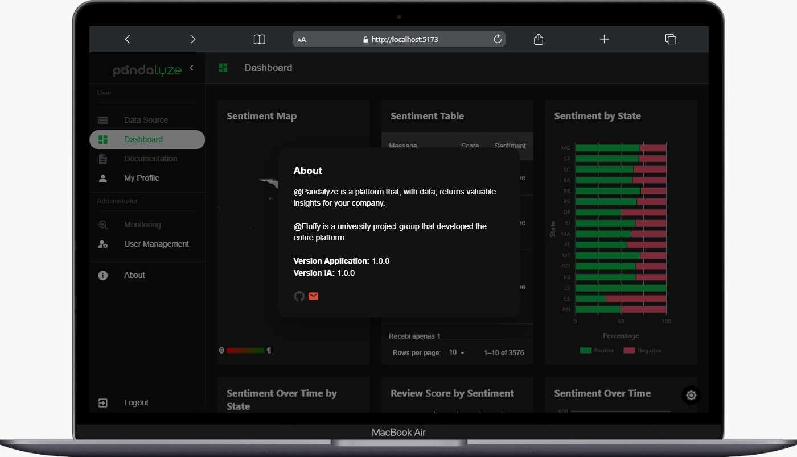
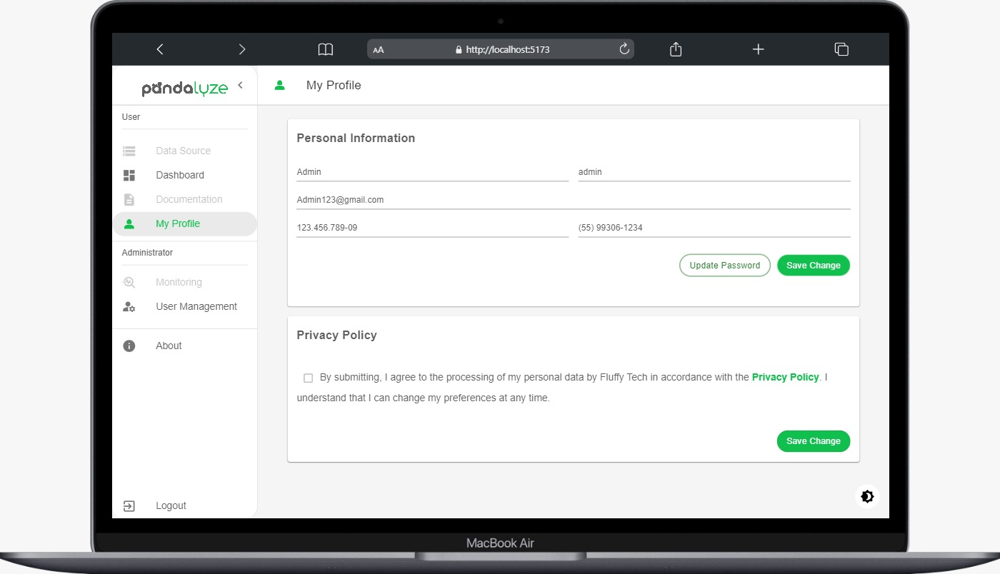
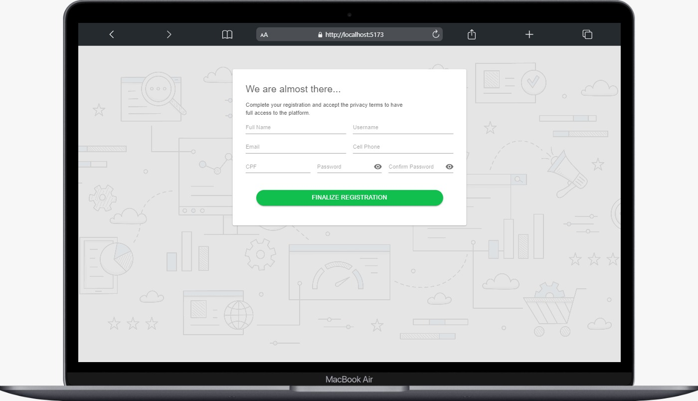
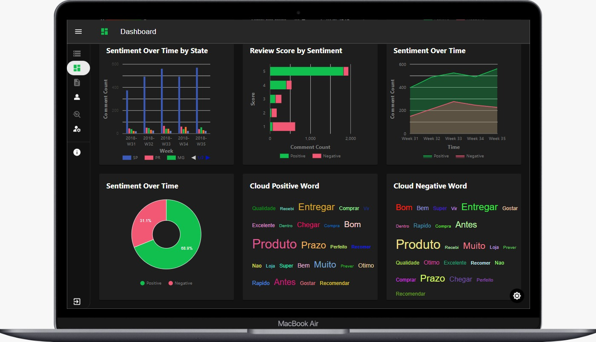

# Projeto 6: 1º Semestre de 2024

### Parceiro Acadêmico

### Visão do Projeto

Neste projeto, buscamos compreender profundamente o sentimento dos clientes através de uma plataforma sofisticada que analisa avaliações online. Integramos tecnologias avançadas para mapear e visualizar esses sentimentos em contexto geográfico real, permitindo às empresas ajustar estratégias com precisão sem precedentes. Nosso objetivo é fornecer insights acionáveis para impulsionar a inovação e o crescimento, inaugurando uma nova era de engajamento do cliente baseada em dados. Este desafio representa uma confluência de tecnologia, análise de dados e estratégia empresarial, projetado para capacitar empresas a antecipar as necessidades dos clientes e estabelecer laços mais fortes em escala global

 

## Resultado Final ✅
#### Aplicação:

|  |  |
|---|---|
|  |  |

### Tecnologias Adotadas na Solução

  

Front-End

* [Vite+React.Js](https://vitejs.dev/guide/)
* [Mui](https://mui.com/material-ui/getting-started/installation/)
* [ApexCharts](https://apexcharts.com/docs/options/chart/events/#click)

Back-End

* [Java](https://www.java.com/pt-BR/?msclkid=7faa842eb8f811ecab39772d4c1ae90b)
* [Spring boot](https://spring.io/projects/spring-boot) 

IA

      
* [Python](https://www.python.org/downloads/)
* [sklearn.neural_network.MLPClassifier](https://scikit-learn.org/stable/modules/generated/sklearn.neural_network.MLPClassifier.html)

Database

  
* [PostgreSQL](https://www.postgresql.org/ftp/pgadmin/pgadmin4/v8.4/windows/)
* [MongoDB](https://www.mongodb.com/try/download/community) 

Meetings and Communication

* [Jira](https://www.atlassian.com/software/jira)

* [Confluience](https://www.atlassian.com/br/software/confluence)

* [Discord](https://discord.com/?msclkid=b4f5af84b8f811ecbd81c127a0ae68a7)

* [Whatsapp](https://www.whatsapp.com/)

* [Slack](https://slack.com/intl/pt-br/?msclkid=c00e628eb8f811ecaef374bb86d7f056)

## Contribuições Pessoais

Na minha contribuição desempenhei o papel de Scrum Master, liderando a equipe em direção aos objetivos estabelecidos. Desde o início, trabalhei em estreita  colaboração com todos os membros para estabelecer um ambiente ágil e altamente produtivo.

Como parte desse papel, minha responsabilidade incluiu facilitar as diversas reuniões do Scrum, como o planejamento do sprint, a revisão do sprint e a retrospectiva. Durante essas sessões, mantive o foco nos objetivos do sprint, resolvendo prontamente quaisquer obstáculos que surgissem e incentivando a equipe a aprender e melhorar continuamente.

Além disso, assumi o compromisso de garantir que a equipe seguisse os valores e práticas ágeis. Isso significava ajudar a identificar e eliminar impedimentos, promover a transparência em todas as etapas do processo e garantir que o backlog do produto fosse mantido atualizado e priorizado de forma adequada para maximizar o valor entregue.

## Distribuição das task´s

* Juntamnete com as user storys foi onde originou cada tarefa e que foi aplicada a cada sprint
* Acompnhamento do desenvolvimento de cada uma delas

## Rastreabilidade no Jira

* Apliquei o conhecimento que obtive no devops e apliquei no quadro de tarefas onde cada uma que precisava da regra cria automatimanete no github a ramificação vinculando com numero do card quem fez e titulo.

## Criação e configuração do repositório

* Criei um repositório separado para cada
  * Repositorio central
  * Repositorio do frontend
  * Repositorio do backend
  * Repositorio do database
  * Repositorio do classificador(IA)
* Criei dentro da pasta de documentação e um readme que descreve cada pasta
  * No readme coloquei DoR e também as user storys mais detalhadas.

colocando em submodulos onde cada uma funcionava de forma inpendente e no final o repositorio central obtinha todas as alterações feitas unificando todos em um unico repositorio tornando mais organizado.

  
### Aprendizados Efetivos (Soft)

`Liderança:` Foi desafiador em cada Sprint, e sempre que surgia algum impedimento, procurava envolver outra pessoa para auxiliar aqueles que enfrentavam dificuldades. Quando possível, trabalhava para resolver os pontos problemáticos, mantendo a qualidade da equipe e resultando em entregas consistentes e satisfatórias para o cliente.

`Gestão do tempo:` Durante a atribuição das tarefas, consegui estimar o tempo necessário para cada uma delas, o que me permitiu criar um cronograma mais preciso para cada sprint, Isso ajudou na gestão do tempo e na entrega eficiente das tarefas designadas.

`Adaptabilidade:` Em meu primeiro contato como Scrum Master, tive a oportunidade de aprender mais sobre o funcionamento da metodologia e aplicá-la no grupo. Isso contribuiu para garantir uma entrega ágil e de valor ao longo do projeto.

`Comunicação eficaz:` Com todas as reunioes de sexta passei sempre o feddback para equiipe a cada alinhamento tanto quando resultado de cada Sprint quanto individual.

 

### Aprendizados Efetivos Hard Skills
<table>
  <tr>
    <th width="300px">Tecnologia/Metodologia</th>
    <th width="300px">Classificação</th>
    <th width="200px">Nível de proficiência</th>
  </tr>
  <tr>
    <td>Jira</td>
    <td>★★★★★★★★☆☆</td>
    <td>Competente</td>
  </tr>
  <tr>
    <td>Confluence</td>
    <td>★★★★★★★★☆☆</td>
    <td>Competente</td>
  </tr>
  <tr>
    <td>GitHub</td>
    <td>★★★★★★★★☆☆</td>
    <td>Competente</td>
  </tr>
  <tr>
    <td>React.js</td>
    <td>★★★★★☆☆☆☆☆</td>
    <td>Sei fazer com ajuda</td>
  </tr>
</table>

[Repositório do Projeto](https://github.com/Fluffy-Fatec/Projeto-Integrador-Imagem)

